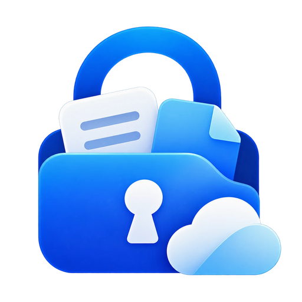

<p align="center">
  
</p>

<h1 align="center">CabinetPass Decryptor</h1>

<p align="center">
  Open-source, offline Vault Viewer for <a href="#cabinetpass">CabinetPass</a> backups,<br />
  plus the format specification and the CabinetPass website.
</p>

<p align="center">
  <a href="https://github.com/codebreaker444/cabinetpass-decryptor/actions/workflows/test.yml"></a>
  
  
  
</p>

---

CabinetPass is a password manager for **iPhone and Mac**. It encrypts
everything on your device with a key that only your master password can
produce. "Trust us" isn't a security model, so this repository lets you
check the encryption yourself:

- **Vault Viewer** ([`decrypt/`](decrypt/)): a single static web page that
  decrypts a CabinetPass backup in your browser and lets you browse items,
  live 2FA codes, SSH keys and attached files. It works offline, its
  Content-Security-Policy blocks every network request, and it runs with no
  server or build step.
- **Reference implementation** ([`decrypt/cabinetpass-crypto.js`](decrypt/cabinetpass-crypto.js)):
  about 200 readable lines covering the whole decryption pipeline. It was
  written separately from the app's Dart code.
- **Format specification** ([`decrypt/FORMAT.md`](decrypt/FORMAT.md)):
  everything needed to write your own decryptor in any language.
- **Tests**: a sample backup exported by the real app, plus checks for
  tampering, wrong passwords, Argon2id reference values and RFC 6238 vectors.

> [!NOTE]
> CabinetPass is **coming soon** to the App Store (iPhone) and the
> Mac App Store. This repository is public before launch so the encryption
> can be reviewed before anyone trusts it with real data.

## Contents

- [Try it in 30 seconds](#try-it-in-30-seconds)
- [How the encryption works](#how-the-encryption-works)
- [What the Vault Viewer guarantees](#what-the-vault-viewer-guarantees)
- [Verify it yourself](#verify-it-yourself)
- [Repository layout](#repository-layout)
- [Hosting the website](#hosting-the-website)
- [CabinetPass](#cabinetpass)
- [Security](#security)
- [License](#license)

## Try it in 30 seconds

1. Clone or download this repository.
2. Open [`decrypt/index.html`](decrypt/index.html) in any modern browser
   (Safari, Chrome, Firefox, Edge). Double-clicking the file works; no
   server is needed.
3. Choose [`decrypt/test/fixtures/sample-backup.cpv`](decrypt/test/fixtures/sample-backup.cpv)
   and enter the password `correct horse battery staple`.

To view your own data, export a backup in the app (**Settings › Export
Encrypted Backup**) and open that file instead. A backup is a single file
holding your encrypted vault and all your encrypted attachments.

> [!NOTE]
> Google Drive sync uploads everything too: `vault.cpv` plus one encrypted
> `att_<id>` file per attachment. They live in Drive's hidden app-data
> folder, which only CabinetPass can read, so they can't be downloaded from
> drive.google.com. The exported backup is the way to get your data out.
> The viewer also opens a bare `vault.cpv` (items without files) if you
> have one, for example from the app's local storage.

> [!TIP]
> For maximum assurance, turn off Wi-Fi before opening your own backup.
> The page can't make network requests anyway, but you don't have to take
> that on trust.

## How the encryption works

```
master password ──Argon2id (64 MiB, 3 passes, 4 lanes, 16-byte salt)──▶ master key (KEK)
master key ──AES-256-GCM, AAD "cabinetpass.dek.v1"──────────────────▶ vault key (random, 256-bit)
vault key  ──AES-256-GCM, AAD "cabinetpass.vault.v1"────────────────▶ gzip(vault JSON)
file key (stored in vault JSON) ──AES-256-GCM, AAD "cabinetpass.file.v1:<id>"──▶ [gzip](file)
```

- **Master password:** never stored or sent anywhere. Argon2id is
  memory-hard, which makes guessing expensive even on GPUs.
- **Vault key:** random. Changing the master password only re-wraps this
  key, so the data itself isn't re-encrypted.
- **File keys:** every attachment has its own random key. That key lives
  inside the encrypted vault, so a file blob is useless without the vault.
- **Tamper detection:** AES-GCM rejects any modified byte. The AAD binds
  each blob to its role and each file to its ID, so blobs can't be swapped.
- **Blob layout:** every blob is `nonce (12) ‖ ciphertext ‖ tag (16)`.

The full specification is in [decrypt/FORMAT.md](decrypt/FORMAT.md).

## What the Vault Viewer guarantees

| Property | How |
|---|---|
| **Nothing leaves the page** | `Content-Security-Policy: connect-src 'none'; default-src 'none'`. `fetch`, XHR, WebSocket, beacons, remote images and fonts are all blocked by the browser. |
| **No third-party code at runtime** | Only three scripts, all in this repo: `vendor/hash-wasm-argon2.umd.min.js` (pinned and hash-checked in CI), `cabinetpass-crypto.js` and `app.js`. |
| **Standard cryptography** | AES-GCM, SHA and HMAC come from your browser's WebCrypto. gzip uses `DecompressionStream`. Argon2id is hash-wasm (WebAssembly). |
| **No script injection** | Vault contents are rendered with `textContent` and DOM APIs only, never `innerHTML`. |
| **Nothing persisted** | No `localStorage`, cookies or IndexedDB. **Lock** revokes file URLs and reloads the page. |
| **Readable** | No bundler, minifier or framework. View source and you see exactly what runs. |

## Verify it yourself

You need [Node.js](https://nodejs.org) 18 or newer. There are no `npm install`
steps and no dependencies.

```sh
npm test
```

It runs [`decrypt/test/run-tests.cjs`](decrypt/test/run-tests.cjs) with
Node's built-in test runner. The suite checks:

| Test | What it proves |
|---|---|
| Vendored hash-wasm | The Argon2id library is byte-for-byte the npm release (CI also re-downloads and compares it). |
| Argon2id reference value | Output matches libargon2, the C reference, and the app's Dart implementation. |
| Sample backup | A backup exported by the real app decrypts to the expected items, groups, 2FA accounts, field values (by SHA-256), attachments (by SHA-256) and SSH key fingerprint. |
| Wrong password | It is rejected with "Incorrect master password." |
| Tampering | Flipping one byte of the vault or of a file, or swapping two files or keys, fails authentication. |
| Bare `vault.cpv` | The vault file alone (without the attachment files) still opens: items, 2FA and notes. |
| Bad input | Non-vault files, unknown versions and unknown KDFs are refused. |
| TOTP | All RFC 6238 test vectors pass for SHA-1, SHA-256 and SHA-512. |

To summarise any backup from the command line:

```sh
node decrypt/test/verify-node.cjs path/to/backup.cpv 'your master password'
```

It prints the decryption steps, item titles and the SHA-256 of every
decrypted file. Avoid putting a real master password in your shell history:
prefix the command with a space, or use a throwaway vault.

The CabinetPass app has its own test suite. It creates vaults with the
app's code and runs them through this implementation, so the two can't
drift apart.

## Repository layout

```
.
├── decrypt/                      Vault Viewer (open this)
│   ├── index.html                page + strict CSP + styles
│   ├── app.js                    viewer UI (DOM only, no innerHTML)
│   ├── cabinetpass-crypto.js     reference decryption library (browser + Node)
│   ├── FORMAT.md                 file-format specification
│   ├── vendor/                   hash-wasm Argon2id 4.12.0 + its MIT license
│   └── test/
│       ├── run-tests.cjs         test suite (npm test)
│       ├── verify-node.cjs       command-line decryptor / summariser
│       └── fixtures/             sample backup + expected values
├── index.html                    CabinetPass website (Tailwind via CDN)
├── assets/                       app-demo.mp4 / .webm / poster (recorded in the iPhone app, demo data)
├── privacy.html, terms.html      privacy policy and terms of service
├── logo.png, favicon.png, apple-touch-icon.png
├── SECURITY.md                   how to report a vulnerability
└── LICENSE                       MIT (code) + brand-asset notice
```

## Hosting the website

The whole folder is a static site with no build step. To preview it locally:

```sh
npm run serve        # → http://localhost:8765
```

It can be hosted as-is on GitHub Pages, Cloudflare Pages, Netlify or any
static host. The Vault Viewer is served at `/decrypt/`.

## CabinetPass

CabinetPass keeps passwords, 2FA codes, cards, SSH keys and private
documents in one encrypted vault for **iPhone and Mac**.

- **Zero-knowledge:** there's no account and no CabinetPass server. Optional
  sync stores only ciphertext in a hidden folder in *your* Google Drive.
- **Encrypted documents:** attach PDFs, scans and photos to any item. Each
  file gets its own key.
- **2FA authenticator:** scan a QR code and see live codes next to the login
  they belong to.
- **SSH keys:** import OpenSSH, PEM or PuTTY keys. The app shows type and
  fingerprint, fills in the public key, gives a one-tap `ssh` command and
  exports key files.
- **Native on both platforms:** Face ID, Touch ID, Password AutoFill and
  widgets on iPhone; sidebar layout, menu bar and keyboard shortcuts on Mac.
- **Coming soon: a built-in SSH terminal.** Swipe a server and tap
  **Connect**. The key is unlocked in memory only, host keys are pinned per
  item, and a shortcut bar provides Esc, Tab, Ctrl and arrow keys.

**Coming soon** to the App Store and the Mac App Store. Website:
[`index.html`](index.html).

## Security

Found a weakness in the format, the crypto or this viewer? Please email
**govardhanchitrada@gmail.com** before disclosing it publicly. See
[SECURITY.md](SECURITY.md).

## About

CabinetPass is built by **Govardhan Chitrada**, an independent developer
and security researcher who became an EC-Council Certified Ethical Hacker
(CEH) at 19. Contact: [govardhanchitrada@gmail.com](mailto:govardhanchitrada@gmail.com).

## License

The code is [MIT](LICENSE). The CabinetPass name, logo and app icon, and the
text of the privacy policy and terms, aren't covered by the MIT License.
hash-wasm is © Dani Biró, MIT.
